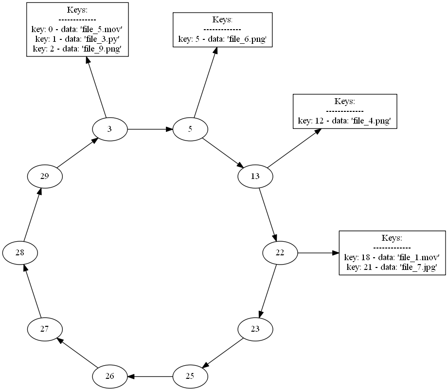

# CHORD-Simulation

[Chord](https://en.wikipedia.org/wiki/Chord_(peer-to-peer)) DHT simulation in Python , a project made for multidimensional data structures course. In order to run it , you should install first the requirements found in requirements.txt by running  pip install -r requirements.txt. Also the program can visualize the created network by using [Graphviz](https://www.graphviz.org/) , so if you wish to use this utillity you should install this program on your machine.

(Network layout generated by Graphviz 

